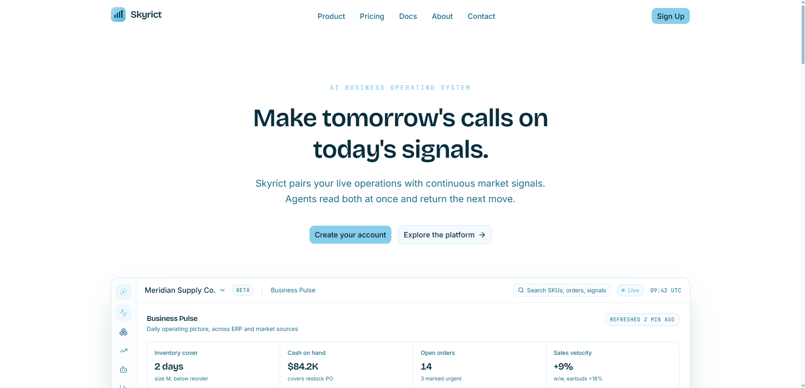
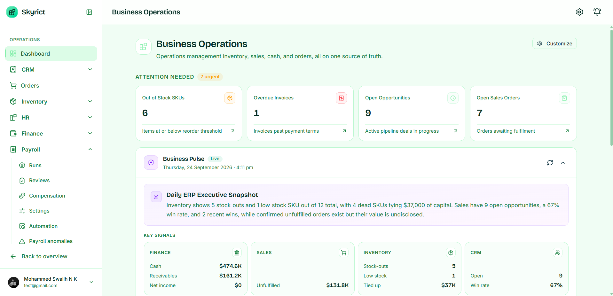
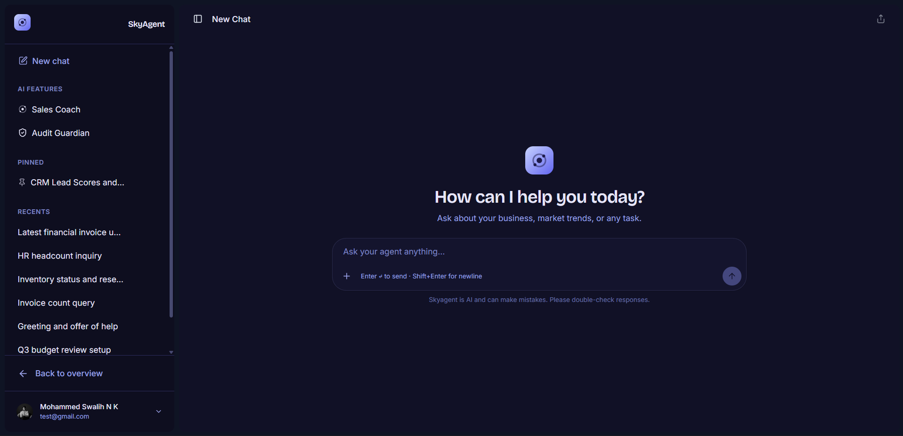
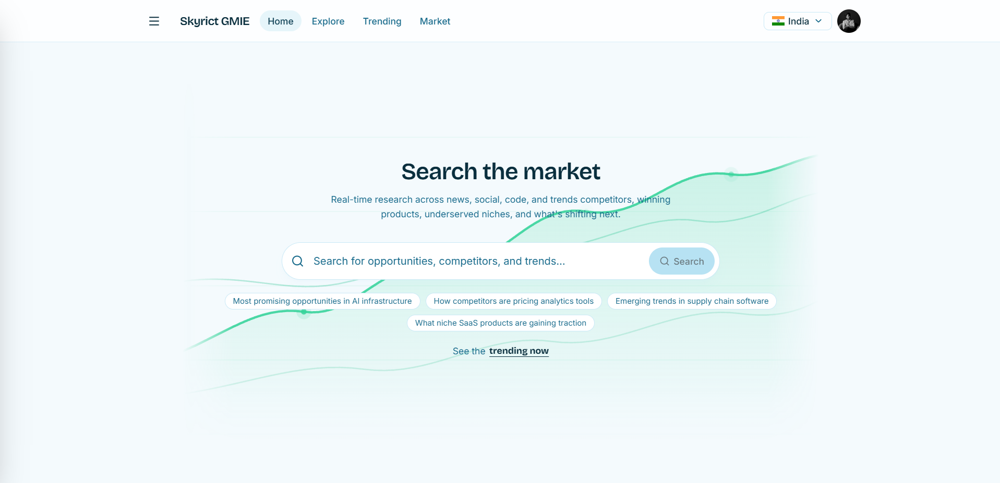
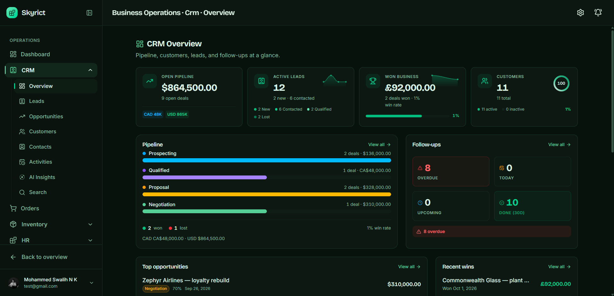

<p align="center">
  
</p>

<h1 align="center" style="border-bottom: none;">Skyrict</h1>

<p align="center">
  <strong>The AI-native business operating system.</strong><br/>
  ERP · AI agents · Global Market Intelligence Engine (GMIE): one platform.
</p>

<p align="center">
  <a href="#quickstart">Quickstart</a> ·
  <a href="#product-tour">Product tour</a> ·
  <a href="#architecture">Architecture</a> ·
  <a href="#roadmap">Roadmap</a> ·
  <a href="CONTRIBUTING.md">Contributing</a>
</p>

<p align="center">
  <a href="LICENSE"></a>
  <a href="CONTRIBUTING.md"></a>
  <a href="https://www.buymeacoffee.com/nkswalih"></a>
  <br/>
  <a href="https://www.python.org/"></a>
  <a href="https://fastapi.tiangolo.com/"></a>
  <a href="https://nextjs.org/"></a>
  <a href="https://www.typescriptlang.org/"></a>
  <a href="https://www.postgresql.org/"></a>
  <a href="https://redis.io/"></a>
</p>

---

## What is Skyrict

Skyrict is an open-source, AI-native platform that merges business operations (ERP) with real-time
market intelligence into a single system. Traditional ERP treats your company as an isolated entity
processing internal transactions. Skyrict treats your company as a node in a live global market,
ingesting external signals, correlating them with internal operations, and letting AI agents act on
the synthesis.

It is built as **three pillars that share one data plane**, instead of three disconnected products:

| Pillar | Layer | What it does | Status |
| --- | --- | --- | --- |
| **ERP** | Operations | Finance, inventory, CRM, sales, HR & payroll, documents and approvals on a multi-tenant core with Row-Level Security | Live |
| **AI Agents** | Automation | Natural-language queries, restock suggestions, anomaly detection, coaching and guardian agents over a provider-agnostic LLM layer | Live |
| **GMIE** | Intelligence | The Global Market Intelligence Engine: market signals, competitor analysis, trend detection, risk assessment and opportunity finding that feed the other two pillars | In progress |

---

## Why Skyrict

| | Traditional ERP | Skyrict |
| --- | --- | --- |
| View of the company | An isolated entity processing internal transactions | A node in a live global market |
| Data | Internal operations only | Internal operations + external market signals |
| Analytics | Descriptive: what happened | Prescriptive: what to do about it |
| AI | Bolt-on chat or report generation | Native layer that reads the same data and acts |
| Tenancy | One deployment per customer | Multi-tenant, Row-Level Security, one codebase |
| Decision loop | Humans read dashboards, then act | Agents correlated with live signals act, humans supervise |

Every module lives in one event-driven workspace, so a finance decision and a market signal are part
of the same system: not two tabs in two products.

---

## Product tour

<p align="center">
  
  <br/>
  <sub><b>Marketing</b>: the public website with hero, product pillars, pricing and contact.</sub>
</p>

<table>
  <tr>
    <td width="50%">
      
      <br/>
      <sub><b>ERP: Finance</b> · invoices, journal entries, budgets, statements and audit logs.</sub>
    </td>
    <td width="50%">
      
      <br/>
      <sub><b>AI Agents</b> · natural-language queries, restock suggestions, guardian and coaching.</sub>
    </td>
  </tr>
  <tr>
    <td width="50%">
      
      <br/>
      <sub><b>GMIE</b> · market, trending and explore: the intelligence layer.</sub>
    </td>
    <td width="50%">
      
      <br/>
      <sub><b>ERP: CRM &amp; Sales</b> · leads, opportunities, customers and the sales pipeline.</sub>
    </td>
  </tr>
</table>

---

## Quickstart

**Prerequisites:** Python 3.12+, Node.js 20+, Docker & Docker Compose v2,
[uv](https://docs.astral.sh/uv/getting-started/installation/), pnpm.

```bash
git clone https://github.com/nkswalih/skyrict.git
cd skyrict

# 1. Install dependencies, boot infra, run migrations
make setup

# 2. Configure environment + generate JWT keys once
cp services/identity/.env.example services/identity/.env
uv run python -m skyrict_testing.generate_keys

# 3. Start the backend (infra + identity service)
make dev

# 4. In another terminal, start the frontend
make dev-web
```

- API docs: `http://localhost:8000/docs`
- Frontend: `http://localhost:3000`

Everything runs through the **Makefile**: see [Development](#development) for the full target list.

<details>
<summary><strong>Local multi-tenant routing</strong>: subdomain-based tenant isolation on localhost</summary>

The identity service is multi-tenant: in production each tenant reaches it via its own subdomain
(`https://acme.skyrict.com/...`) and the ingress injects an `X-Tenant-Slug` header before forwarding.
The dev stack mirrors that contract locally, so tenant resolution behaves identically in both
environments.

`docker compose` (dev) starts an `nginx` proxy (see `infra/nginx/dev.conf`) that routes `*.localhost`
subdomains to the identity service and derives `X-Tenant-Slug` from the subdomain, so no `/etc/hosts`
edits are needed on most machines (`*.localhost` resolves to `127.0.0.1` automatically).

```bash
docker compose -f infra/docker/docker-compose.yml -f infra/docker/docker-compose.dev.yml up -d

curl -s http://acme.localhost/api/v1/health      # X-Tenant-Slug: acme
curl -s http://globex.localhost/api/v1/health    # X-Tenant-Slug: globex
```

**Path-based fallback** (no wildcard DNS): `http://localhost/acme/api/v1/health` →
`/api/v1/health` + `X-Tenant-Slug: acme`.

**Port 80 in use?** Set `NGINX_PORT=8080` in `infra/docker/.env`, then use
`http://acme.localhost:8080/docs`.

The tenant is resolved **once per request in middleware** and cross-checked against the JWT
`tenant_id` claim on every authenticated request; a mismatch is rejected with 401. See the
[identity service README](services/identity/README.md) for details.
</details>

<details>
<summary><strong>Manual setup</strong>: if you prefer running each step yourself</summary>

```bash
uv sync                                            # Python deps
cd apps/web && pnpm install                        # Frontend deps
docker compose -f infra/docker/docker-compose.yml up -d   # Postgres + Redis
make migrate                                       # Alembic migrations
make dev                                           # Start backend
make dev-web                                       # Start frontend
```
</details>

---

## Features

Three layers, one data plane. Status legend: **Live** · **In progress** · **Planned**.

### Operations: ERP

| | | |
| --- | --- | --- |
| **Finance** · Live<br/>Invoices, journal entries, budgets, expenses, accounts, assets, statements, controls, audit log, compliance | **Inventory** · Live<br/>Products, warehouses, movements, suppliers, stock health, ABC analysis, demand forecast | **CRM & Sales** · Live<br/>Leads, opportunities, contacts, customers, activities, orders, approvals, AI-assisted pipeline |
| **HR & Payroll** · Live<br/>Leave, planning, payroll runs, reviews, compensation, anomalies | **Procurement** · Planned<br/>Purchasing reusing stock and order primitives | **Documents & Reports** · Live<br/>Document workspace and a report center over live data |

### Identity & security

| | | |
| --- | --- | --- |
| **Authentication** · Live<br/>JWT (RS256, access + refresh), registration, login, logout | **MFA & sessions** · Live<br/>TOTP enroll/verify, session management and revocation | **RBAC role builder** · Live<br/>Custom roles composed from a fixed permission menu |
| **Multi-tenant RLS** · Live<br/>Tenant context via `ContextVar`, every query scoped by PostgreSQL RLS | **Audit & invites** · Live<br/>Audit logging and member invitations | **SSO & passkeys** · In progress<br/>OIDC/SAML and passkey stubs behind the same permission model |

### AI agents: automation layer

| | | |
| --- | --- | --- |
| **Provider-agnostic LLM routing** · Live<br/>OpenRouter, Groq, OpenAI, or local Ollama behind one interface with a primary → fallback chain | **Natural-language queries** · Live<br/>Ask your inventory in plain English and get structured answers | **Restock suggestions** · Live<br/>Recommend replenishment from current stock and demand signals |
| **Anomaly detection** · Live<br/>Flag unusual stock movement for review | **Guardian & coaching consoles** · In progress<br/>Agent workspaces in the web app | **RAG / LangGraph agents** · Planned<br/>Document-grounded agents with tool-use orchestration |

### Intelligence: GMIE

| | | |
| --- | --- | --- |
| **Intelligence workspace** · In progress<br/>Market, trending, explore, and results pages in the web app | **Signal collection engine** · Planned<br/>Ingest external market signals with scoring and correlation | **Competitor & trend analysis** · Planned<br/>Detect moves and trends from collected signals |
| **Risk assessment** · Planned<br/>Score exposure and risk from combined signals | **Opportunity finding** · Planned<br/>Surface actionable opportunities to the ERP layer | **Event-driven topics** · Planned<br/>Kafka bus for async signal → operation flows |

Every capability above maps to a real surface in the repo: module specs live in
[`docs/modules/`](docs/modules/), and the release history is in [`CHANGELOG.md`](CHANGELOG.md).

---

## Architecture

Three services behind one API: **identity** (auth, MFA, RBAC, tenants), **core** (ERP),
and **ai-agent** (provider-agnostic LLM), sharing PostgreSQL with Row-Level Security and Redis.

- **Multi-tenancy by default.** Every tenant-scoped table carries a `tenant_id`; RLS scopes every
  query to the current tenant. One codebase serves all customers.
- **AI behind authorization.** The frontend never calls `ai-agent` directly, requests go through
  `core` (`/api/v1/ai/*`), which enforces `erp.ai.invoke` plus the module permission *before*
  forwarding and re-relays the caller's JWT. Agents can never bypass human authorization.
- **Event-driven by design.** Domain events use `{domain}.{entity}.{action}` naming
  (`identity.user.created`, `inventory.stock.level_changed`) on a Kafka bus that goes live once
  async coupling is needed.

See [`docs/architecture/`](docs/architecture/) for ADRs and the [product handbook](docs/handbooks/).

---

## Development

```bash
./scripts/setup-hooks.sh      # macOS/Linux: install git hooks once
.\scripts\setup-hooks.ps1     # Windows

make setup          # Install deps, create DB, run migrations
make dev            # Start backend (infra + identity service) in dev mode
make dev-web        # Start Next.js dev server
make dev-all        # Start everything
make test           # Run all tests
make test-unit      # Unit tests only
make test-cov       # Tests with coverage
make lint           # Ruff + mypy
make format         # Auto-format code
make migrate        # Run pending Alembic migrations
make migrate-create MSG="add users table"   # Create a new migration
make seed           # Load reference data
make build          # Build Docker image
make check          # Full CI check (lint + test)
make clean          # Remove build artifacts
make help           # Show all targets
```

Pre-commit hooks run Ruff lint/format, mypy, file validation and conventional-commit checks.
Branch protection requirements (PR-only workflow, required reviews, CI checks) are in
[`docs/setup/branch-protection.md`](docs/setup/branch-protection.md).

### AI Agent service (local dev)

The `ai-agent` service (port 8002) is provider-agnostic: any OpenAI-compatible endpoint works
(OpenRouter, Groq, OpenAI, or local Ollama). With no provider configured the service boots and
serves health; AI calls then return a typed `503 ai_unavailable`.

```bash
AI_DATABASE_URL=postgresql+asyncpg://...     # ai-agent's own DB
AI_REDIS_URL=redis://localhost:6379/0        # distributed rate limiting
AI_JWT_PUBLIC_KEY_PATH=./secrets/jwt_public.pem
AI_JWKS_ISSUER=https://auth.skyrict.io
AI_JWKS_AUDIENCE=api.skyrict.io
AI_PROVIDER=openrouter                       # or groq/openai/omniroute/agentrouter/generic
AI_MODEL=meta-llama/llama-3-8b-instruct
AI_API_KEY=sk-or-...

uv run ai-agent serve                        # from services/ai-agent (typer CLI)
uv run ai-agent migrate
```

Full wiring (including the compose contract and the `/api/v1/ai/*` permission proxy) is in the
[ai-agent README](services/ai-agent/README.md) and
[docs/modules/skyrict-ai/](docs/modules/skyrict-ai/).

---

## Roadmap & scope

Skyrict is deliberately **MVP-first**: ship a small, secure, well-tested core before expanding scope.

- **Done**: Identity platform (JWT, MFA, RBAC role builder, multi-tenant RLS), ERP foundations
  (finance, inventory, CRM/sales, HR/payroll), provider-agnostic AI agent layer, web app, CI/CD on all
  four surfaces.
- **In progress**: GMIE intelligence workspace, agent consoles (guardian/coaching), web polish.
- **Planned**: GMIE signal-collection engine, RAG/LangGraph agents, OLAP/analytics, embedded
  event bus usage once 3+ services need async events.
- **Deferred until a concrete need justifies them**: SSO (SAML/OIDC), OPA policy engine,
  HashiCorp Vault, SCIM provisioning, adaptive risk scoring.

---

## Contributing

See [CONTRIBUTING.md](CONTRIBUTING.md) for the development workflow, code standards, and PR process.
Bug reports and feature requests use the issue templates; the project is CI-gated on every surface.

## Security

To report a vulnerability, see [SECURITY.md](SECURITY.md). Do **not** open a public issue for
security reports.

## Contributors

Skyrict is built by an open community: thank you to everyone who has shipped code, docs, and ideas.

<p align="center">
  <a href="https://github.com/nkswalih" title="nkswalih"></a>
  <a href="https://github.com/dennisjoseph2025" title="dennisjoseph2025"></a>
  <a href="https://github.com/abhikrishna-a" title="abhikrishna-a"></a>
  <a href="https://github.com/ABHINAV9496" title="ABHINAV9496"></a>
</p>

<p align="center">
  <sub>See the <a href="https://github.com/nkswalih/skyrict/graphs/contributors">full contributor graph</a>. Contributions welcome.</sub>
</p>

---

## Support the Project

If Skyrict helps your business or research, consider supporting independent development:

<p align="left">
  <a href="https://www.buymeacoffee.com/nkswalih" target="_blank">
    
  </a>
</p>

---

## License

Apache License 2.0: see [LICENSE](LICENSE). Skyrict trademarks and usage guidelines:
[TRADEMARK.md](TRADEMARK.md).
